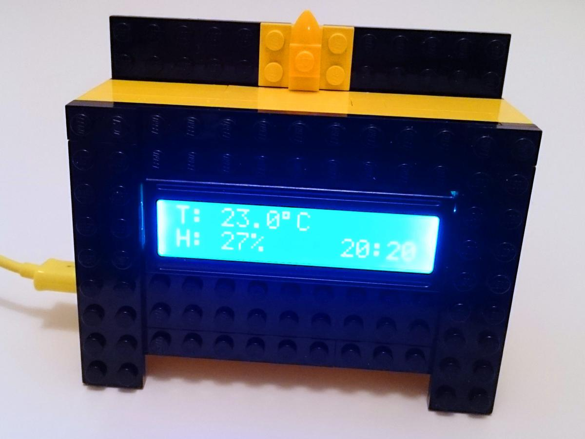
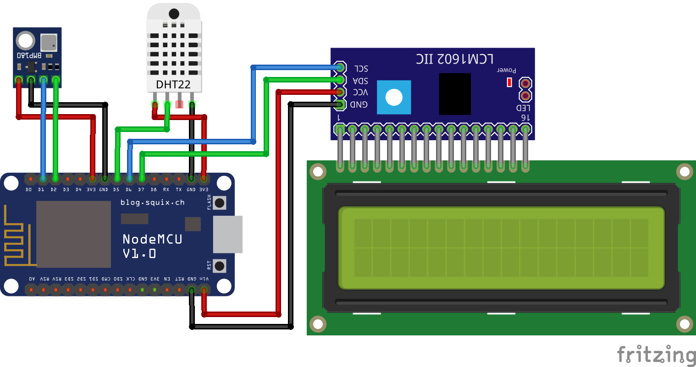

# micropython-weatherstation

A really simple weather station built with [NodeMCU](http://www.nodemcu.com/index_en.html) and [MicroPython](https://micropython.org/).

## Features

* Measures temperature, humidity and barometric pressure
* Get correct time via [NTP](https://en.wikipedia.org/wiki/Network_Time_Protocol)
* Display measurements on a built in LCD display
* Send measurements to [Graphite](https://graphiteapp.org/)
* Ability to connect to one of the predefined wireless networks
* When not connected to any of the defined wireless networks, run in access-point mode

## Hardware

* [NodeMCU](https://www.aliexpress.com/item//32341789414.html) (ESP8266 development board)
* DHT22 temperature and humidity sensor (also known as RHT03)
* DMB180 barometric pressure sensor
* 16x2 character [LCD display](https://www.aliexpress.com/item//1370294953.html) with LCM1602 I2C controller
* A bunch of LEGO bricks to build the enclosure

Links take you to the actual items I bought.

## Connecting the hardware

The following diagram should make it clear how to connect all components together. You should be careful to connect the VCC pin of the LCD I2C controller to Vin pin of NodeMCU as it needs 5 volts. The two sensors are fine being supplied with 3.3 volts.

## The code and extra libraries

Two external libraries are required:

* [micropython-bmp180](https://github.com/micropython-IMU/micropython-bmp180)
* [python_lcd](https://github.com/dhylands/python_lcd/)

## Configuration

There are some variables you'll need to change in the code, to get your weather station up and running:

* In `weatherstation.py` set `SERVER_NAME` to the hostname of your Graphite server.
* In `nethelper.py` change `NETWORKS` to a list of wireless networks you want your weather station to try to connect to.
* (optional) In `nethelper.py` change `AP_CONFIG` to set the SSID and PSK of the network advertised while we fail to connect to any network set in `NETWORKS`.
* (optional) In `clock.py` change `NTP_HOST` to the hostname of your preferred NTP server.

## Loading the code

You'll need to load the following files onto your ESP8266:

* boot.py
* main.py
* weatherstation.py
* nethelper.py
* clock.py
* bmp180.py (from micropython-bmp180 library)
* lcd_api.py (from python_lcd library)
* esp8266_i2c_lcd.py (also from python_lcd library)

Take a look at this excellent [guide](https://learn.adafruit.com/micropython-basics-load-files-and-run-code/) on Adafruit if you need help with this.

After this, reboot the ESP8266 and with some luck you should see the LCD light up with the current temperature and humidity. And if by some miracle your weather station connects to the configured wireless network the correct time should pop up as well.

## Plans for improvements

* Configuration file that classes read when loaded
* Web interface for configuration
* Make some features optional (writing to Graphite, fallback AP) and configurable (Graphite metric prefix)
* Replace BMP180 with the newer BME280
* Add a button or two do to change display modes and other features
* Replace LCD with a display that doesn't require a backlight and is readable in sunlight
* A battery powered outdoor unit that communicates wirelessly with the main unit
* Other sensors like wind, precipitation...
* And the kitchen sink. Just kidding, we'll run out of memory way before that :)

And you can also [suggest your own](https://github.com/matejv/micropython-weatherstation/issues)!
